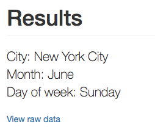

# Bikeshare Web Application

Bikeshare is a web application to explore some US bikeshare data related to bike share systems for three major cities in the United States—Chicago, New York City, and Washington.

## Requirements

To run the application, you need to install [Anaconda](https://www.anaconda.com/what-is-anaconda/)

## Create the Anaconda environment

In order to create a new Anaconda environment, run the following command:
```bash
$ conda env create -f environment.yml
```

or
```bash
$ ./create_env.sh
```

Once created, you have to activate it:
```bash
$ source activate bikeshare
```

## Start the Flask server

Now, the Flask server should be started:
```bash
$ ./run.sh
```

You should get the following output:
```bash
 * Serving Flask app "bikeshare.py" (lazy loading)
 * Environment: development
 * Debug mode: on
 * Running on http://127.0.0.1:5000/ (Press CTRL+C to quit)
 * Restarting with stat
 * Debugger is active!
 * Debugger PIN: 295-512-990
```

## Bikeshare user interface

Now, the Flask server is running, so open your browser and go to `http://127.0.0.1:5000`:


Here, you can choose the city whose data you want to analyze, and filter by month and day of the week by selecting it in the form and clicking the submit button:


The data will appear on the next screen


You can see the raw data by clicking the link *View raw data* in the Results section:



And here is the raw data:


## Code

Some things have changed from the original proposal, the `bikeshare` module contains the `Bikeshare` class whose methods are responsible for extracting data and calculating statistics.
I have also created three supporting modules: `formatter`, `stats` and `utils`.

The `formatter` module contains functions that converts numbers to a human readable format.

The `stats` module contains four classes (`TimeStats`, `StationStats`, `TripDurationStats` and `UserStats`). They store the results of the calculations made by the `bikeshare` module.

The `utils` module contains utility functions like `month_name(month)` that returns the month name given a number or `city_data_file_path(city)` that returns the csv file path of the city.

The `main` package contains the web application views (`views.py` and `errors.py`) and a module called `filters` that contains custom Jinja2 [filters](http://jinja.pocoo.org/docs/2.10/api/#writing-filters)

```
| - bikeshare_web/
    | - app/
        | - main/
           | - __init__.py
           | - errors.py
           | - filters.py
           | - views.py
        | - static/
        | - templates/
        | - __init__.py
        | - bikeshare.py
        | - formatter.py
        | - stats.py
        | - utils.py
```

## References

- [Python 3.6.5 Documentation](https://docs.python.org/3/index.html)
- [Pandas 0.23 Documentation](http://pandas.pydata.org/pandas-docs/version/0.23/index.html)
- [NumPy 1.14.1 Reference](https://docs.scipy.org/doc/numpy-1.14.1/reference/index.html)
- [Anaconda Documentation](https://conda.io/docs/user-guide/install/download.html)
- Grus, J., 2015. [Data Science from Scratch](http://shop.oreilly.com/product/0636920033400.do). 1st ed. O'Reilly Media
- McKinney, W., 2017. [Python for Data Analysis](http://shop.oreilly.com/product/0636920050896.do). 2nd ed. O'Reilly Media

Web application and user interface:

- [Flask 1.0 Documentation](http://flask.pocoo.org/docs/1.0/)
- [Jinja2 Documentation](http://jinja.pocoo.org/docs/2.10/templates/)
- [Bootstrap Documentation](https://getbootstrap.com/docs/3.3/getting-started/)
- Grinberg, M., 2014. [Flask Web Development](http://shop.oreilly.com/product/0636920031116.do). 1st ed. O'Reilly Media
